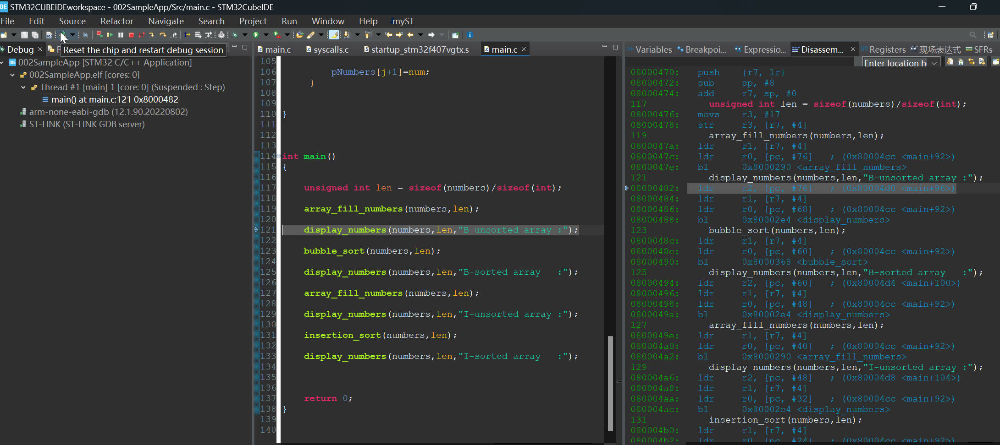
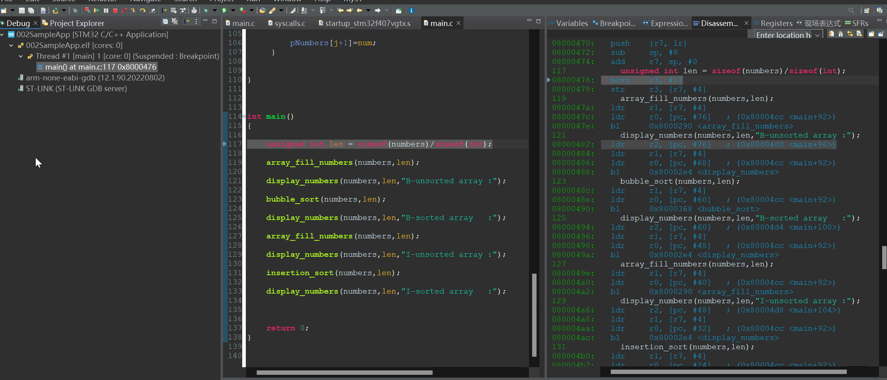
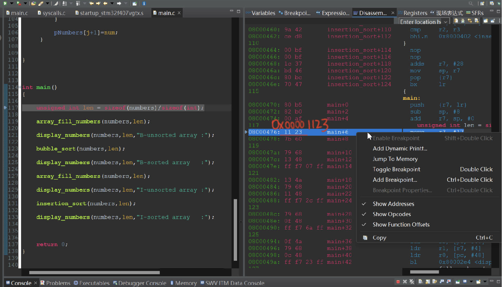
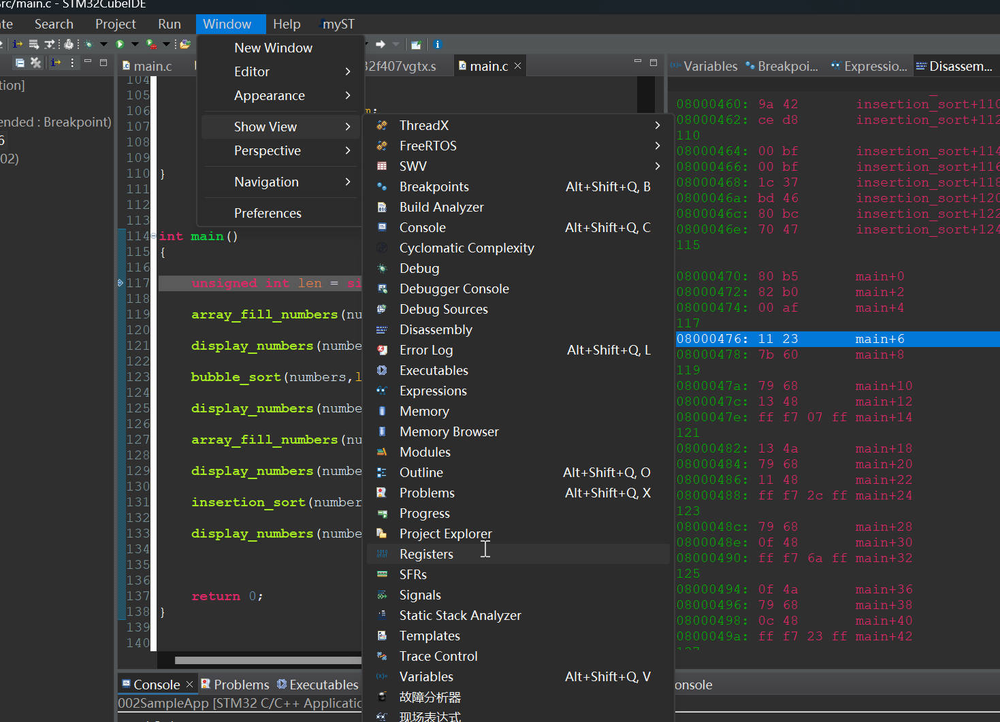
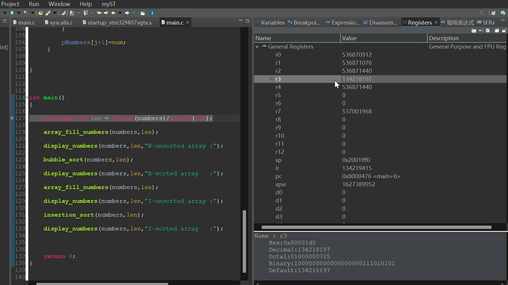

# 19. Disassembly and Register Windows

### Reset the Chip

### The Execution goes back to the first line

### Show the Operand Code Address and Offset

### Show the Register 

This helps you to analyze the ARM Cortex Processors internal register.

