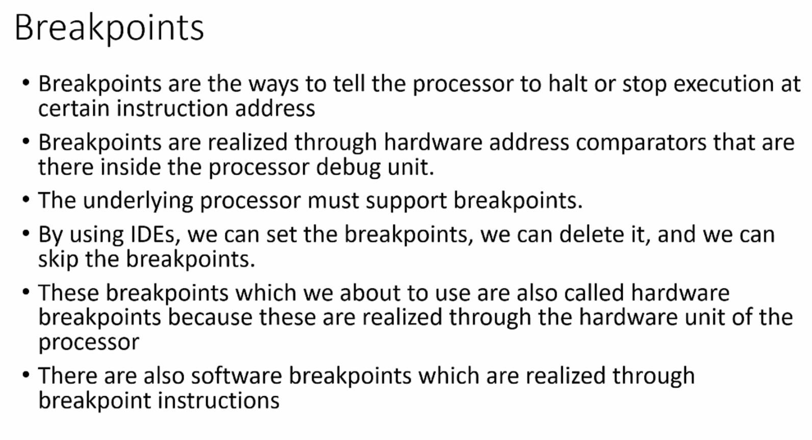
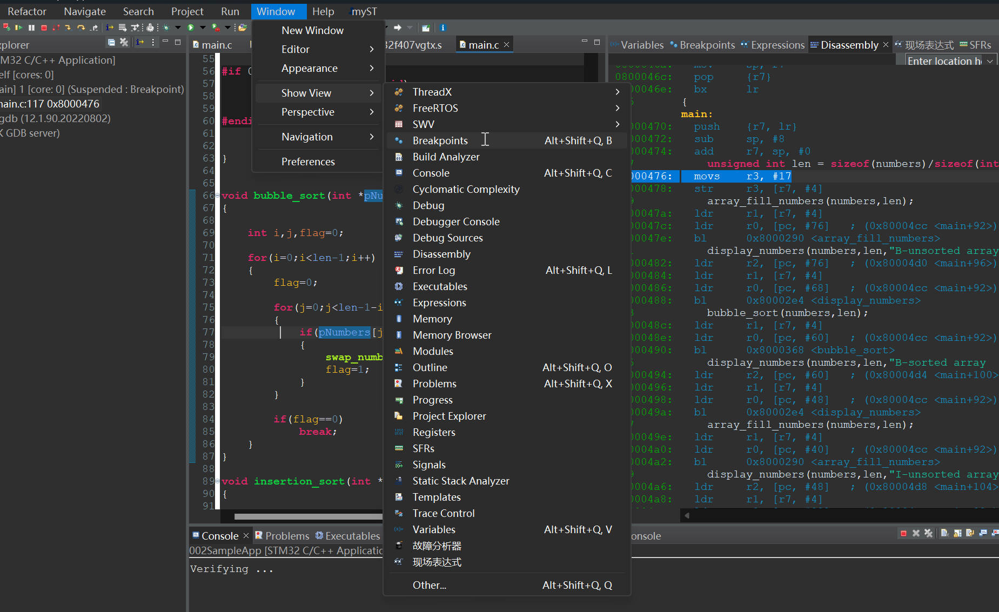
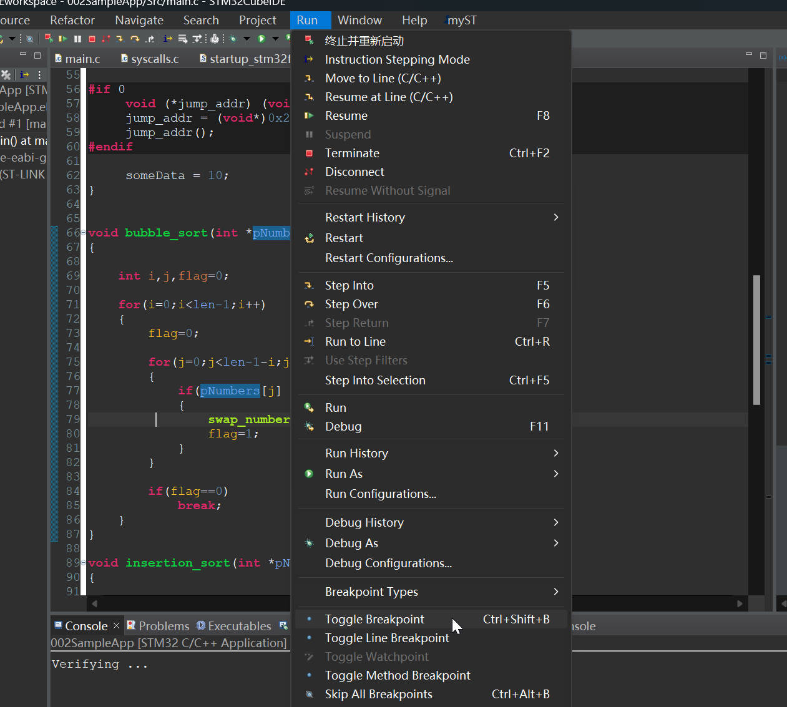
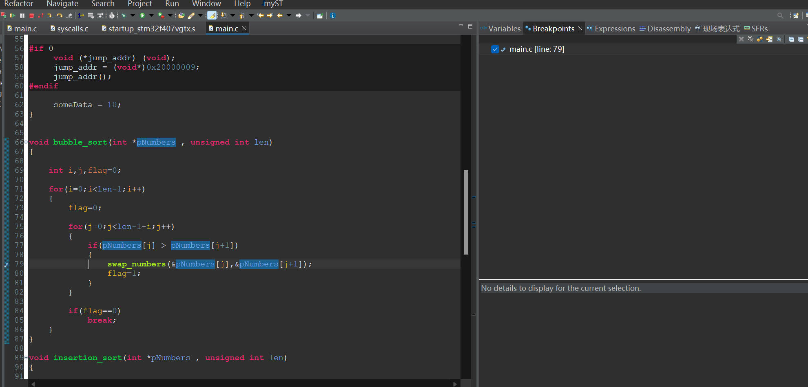

# 20. Breakpoints

## What is BreakPoints?

## How to Use the Breakpoints

Open the window to find `Breakpoints`

Select `run` then select the `toggle breakpoint`

The Breakpoints are set  
Or just double clicks the header of the instruction line before the number.

The number of breakpoints are decided by the number of Address Comparator Unit in the CPU, commonly, the Address Comparator Unit number is no more than 6, decided by the CPU type.

 

