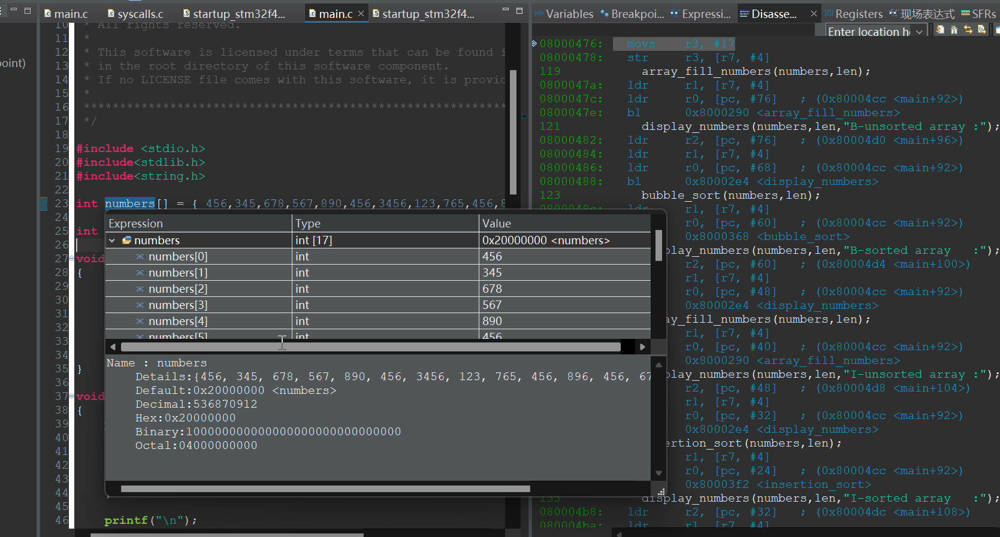
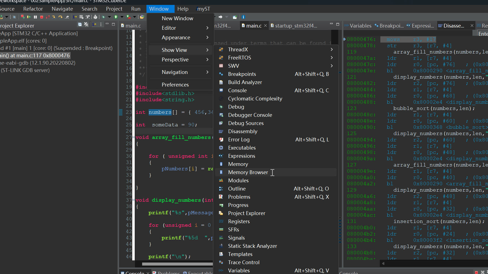
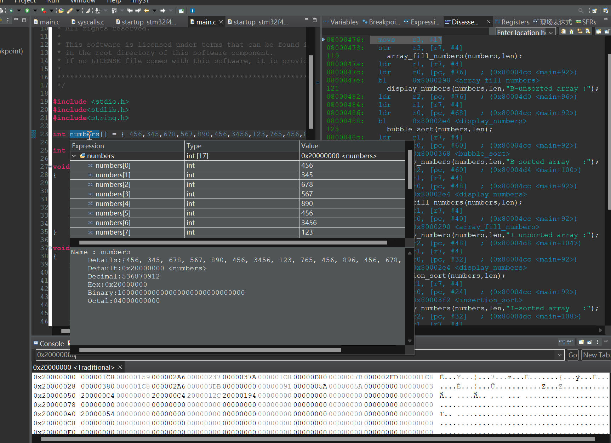
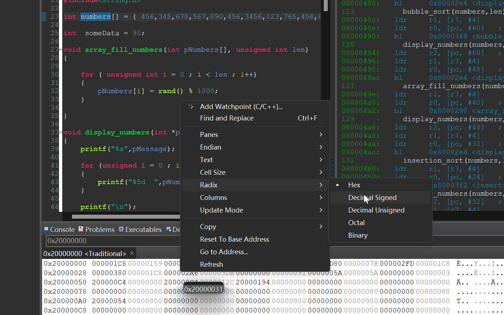
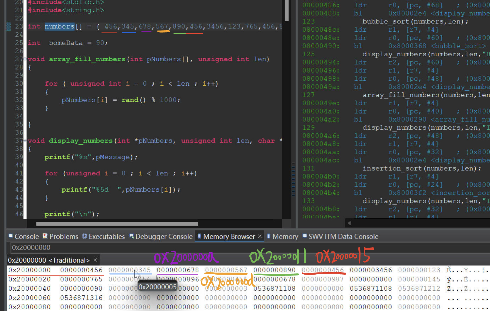
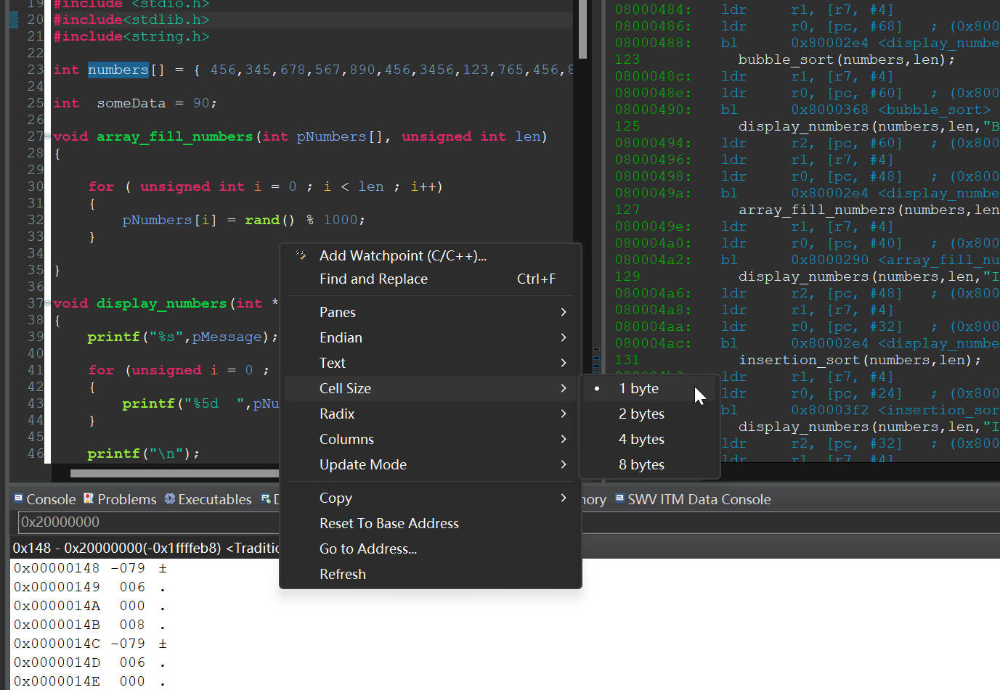
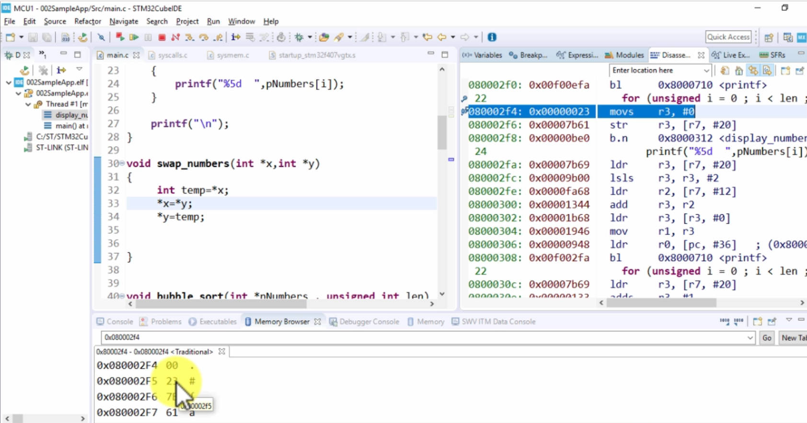

# 22. Memory Browser Windows

The Basic address of the array which stored at the SRAM

## Check Array in the Memory Window

Change it to decimal

Explain:

When change the memory cell size to 1 byte, as you can see

The address only contain two hex number, because 1 byte = 2 hexadecimal 