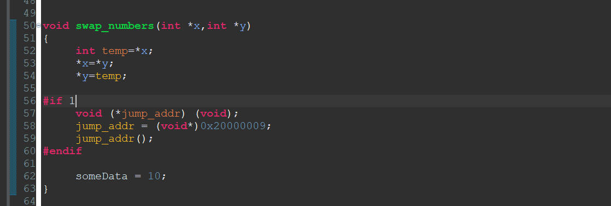
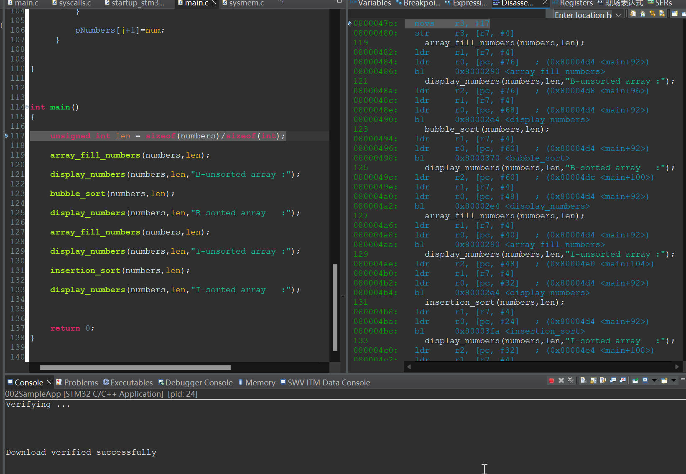
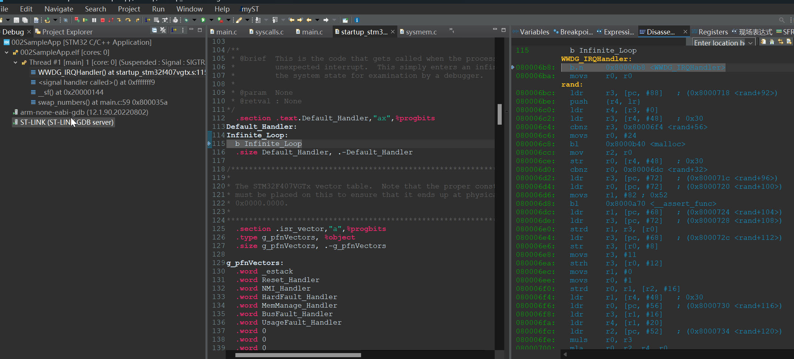
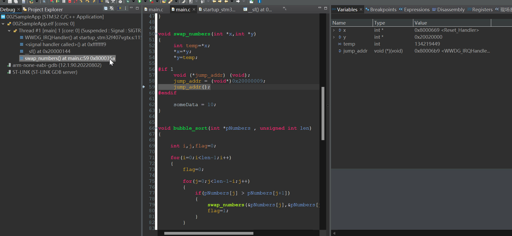
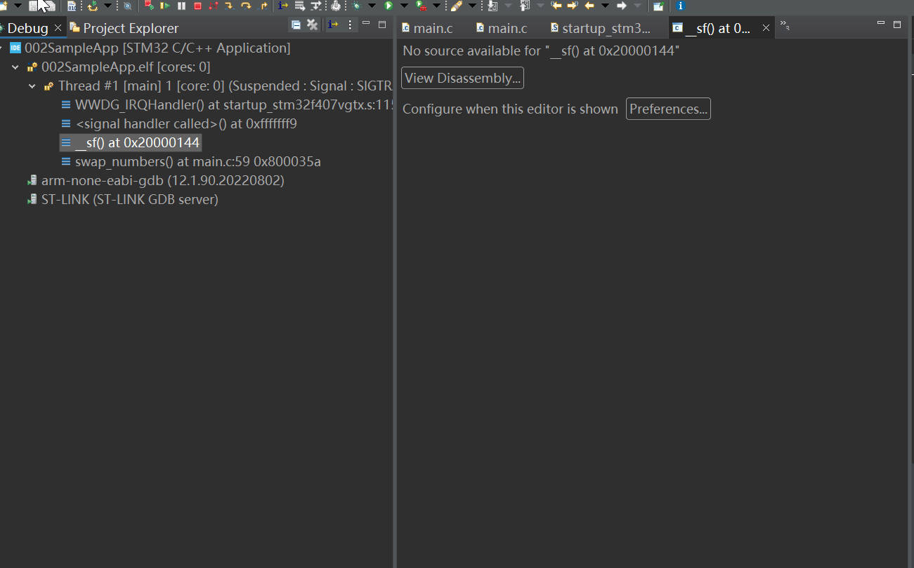
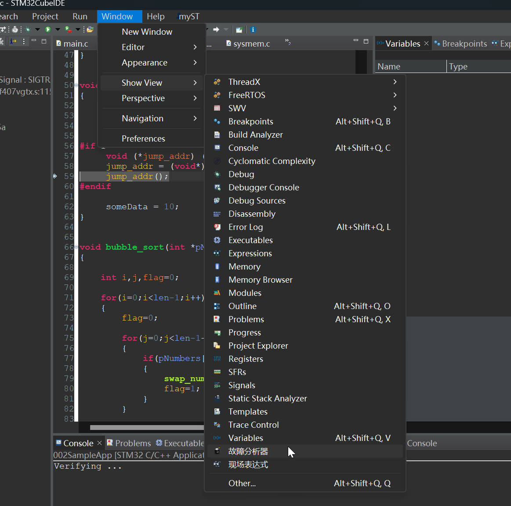
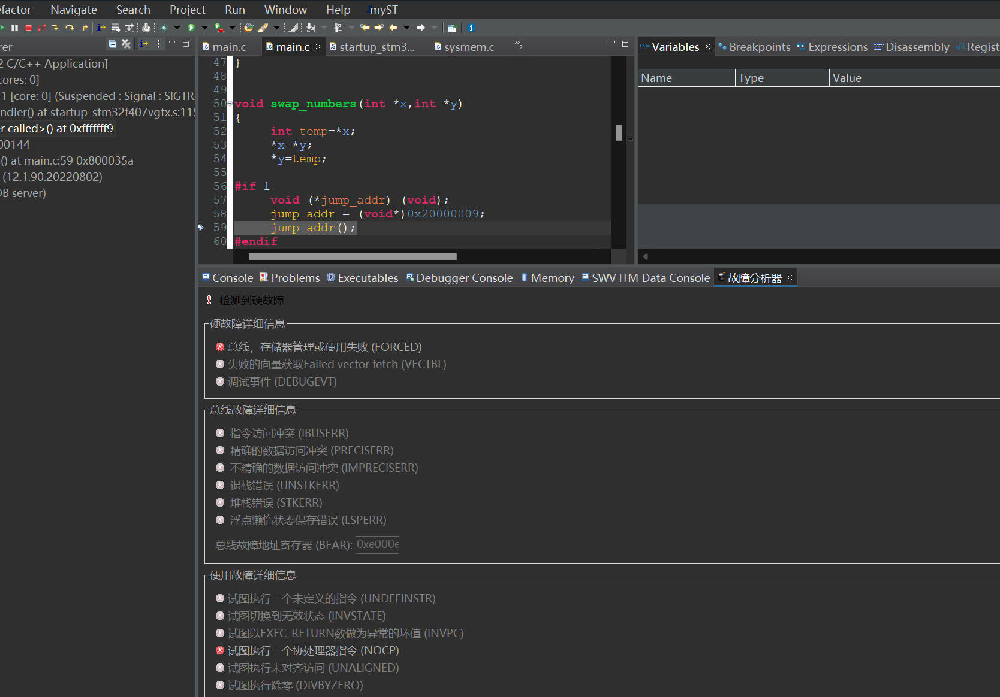

# 23. Call Stack and Fault Analyzer

## Call Stack Feature

Trace the Function execution to see where happens the wrong.

### Add a Wrong function inside the swap_numbers()

When Processor tries to fetch an instruction from this memory location, since the instruction was not valid(No function in there), that would be instruction fault.

Re-debug it and load it to the discovery board, no thing wrong happen.

Go `resume`

Code is trapped on the infinite loop, meets problem.

as you can see, there is no function in there.

## Open the Analyzer

Go to the Fault Analyzer to see what happen

