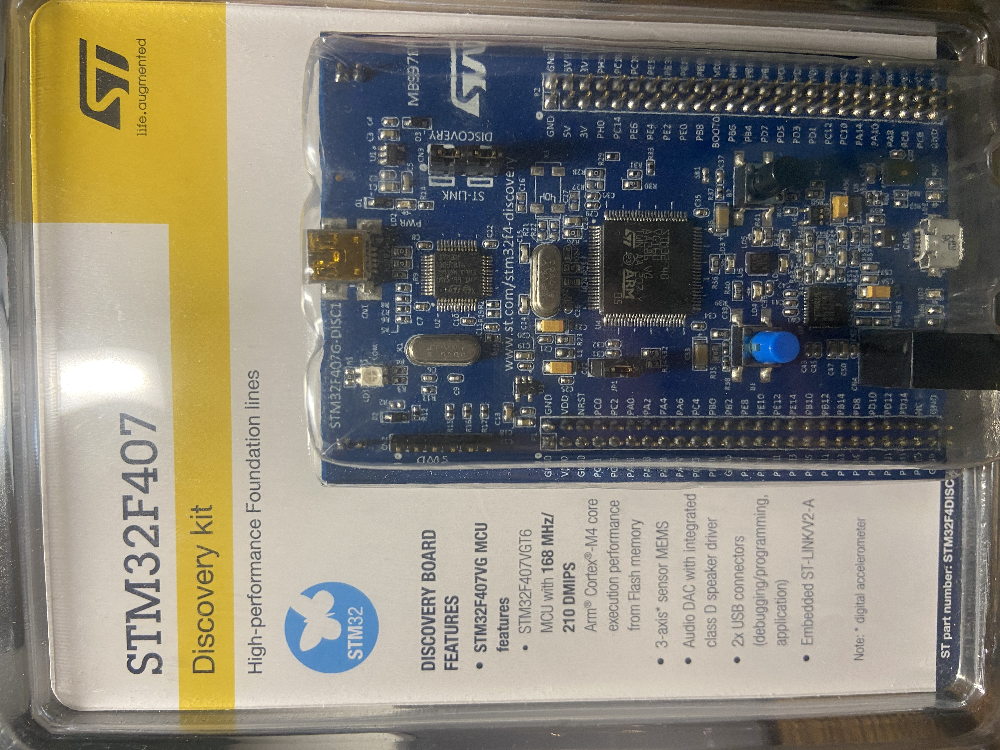
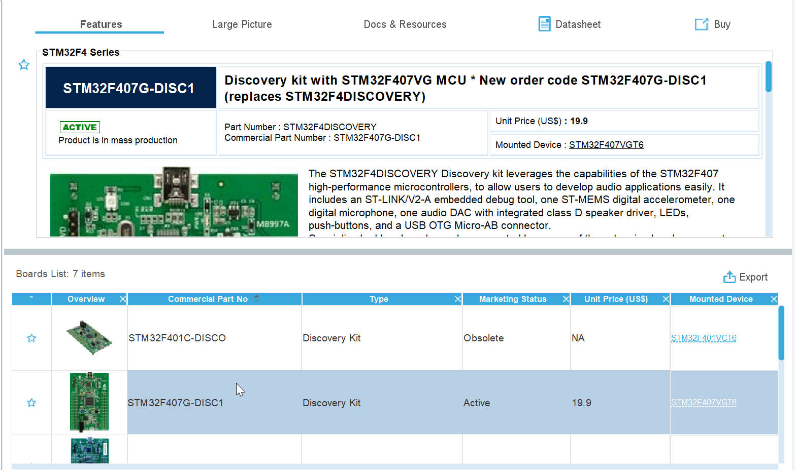
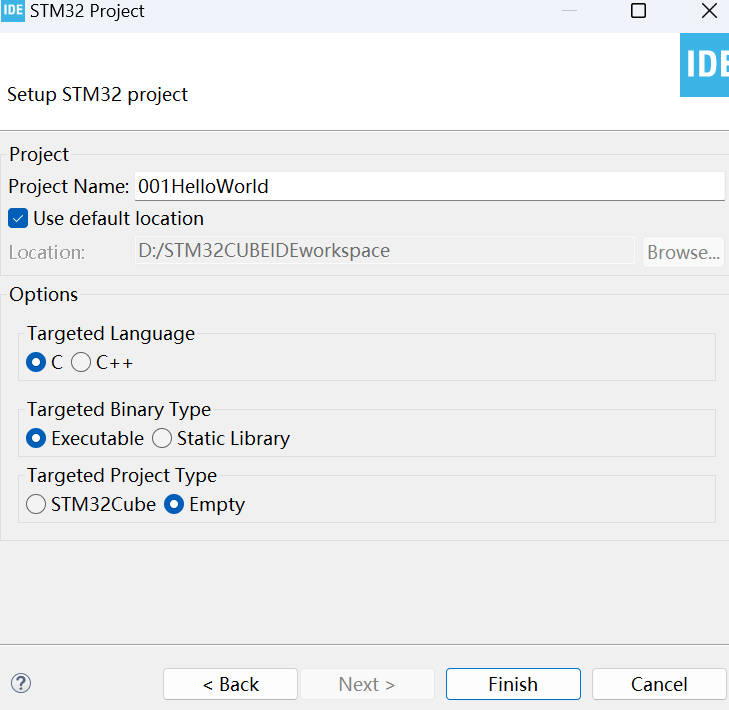
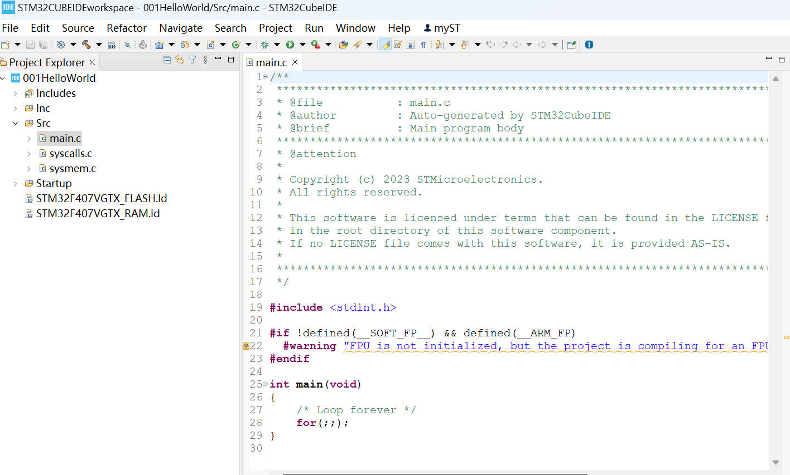
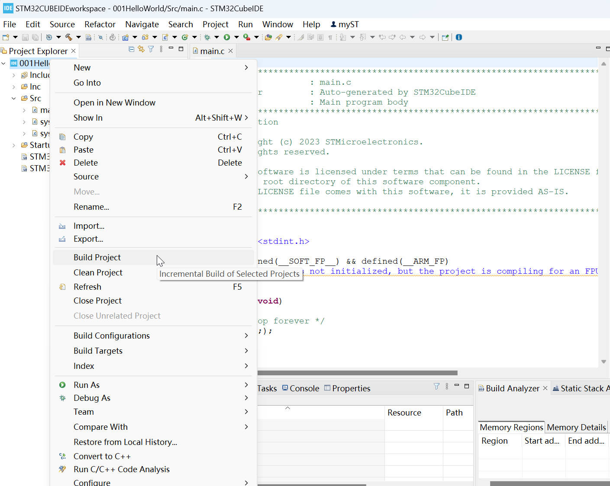
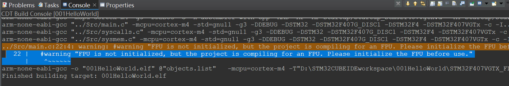
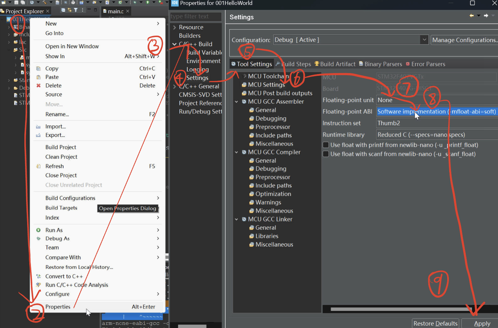
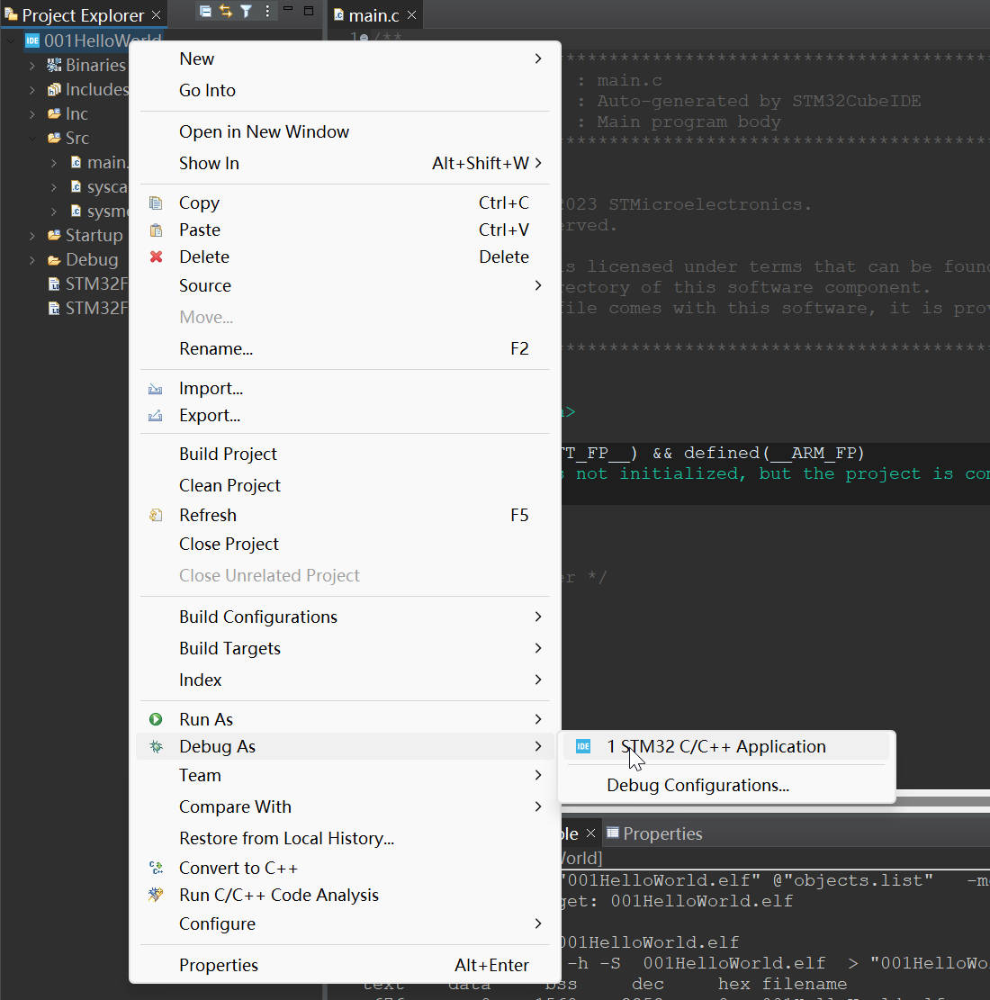
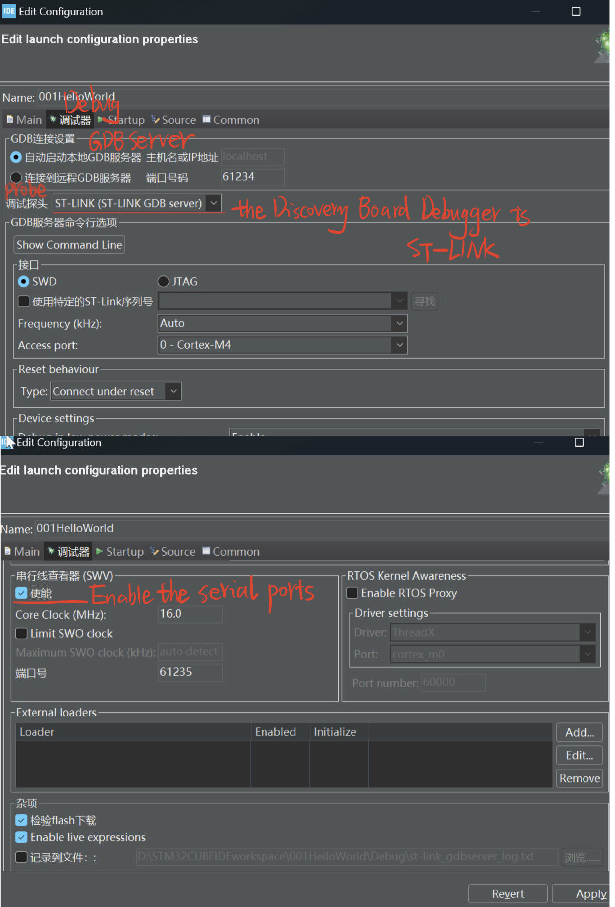
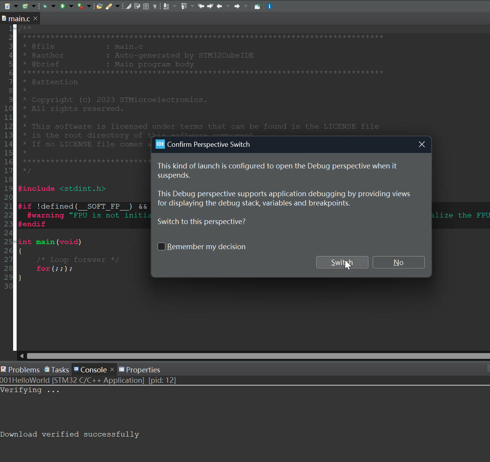

# 13 Creating Hello-World Project

## The Discovery Board

Open the `STM32CUBEIDE` IDE

Select on the new project search box and try to find the `STM32F4DISCOVERY` , in 2023, this board name has been changed to `STM32F407G-DISC1`

The STM32Cube is function for peripheral configuration using STM32CubeMX code

`Src` folder includes a `main.c` entry file.

## Compile a Project

### Meet a Warning

FPU is stand for `Floating Point Unit `, which are not used in this project. So in order to solve this warning, we choose to disable it.

## Download Project onto the Target

This option downloads the code onto the target and also it puts the board into debug mode

#### Create debug Configuration

#### Debug and Switch Perspective to the Board Debugger

Now the Discovery Board is going to debug mode.  
Change The perspective IDE into the debug perspective.   

Then the STM Discovery Board will run your command lines.