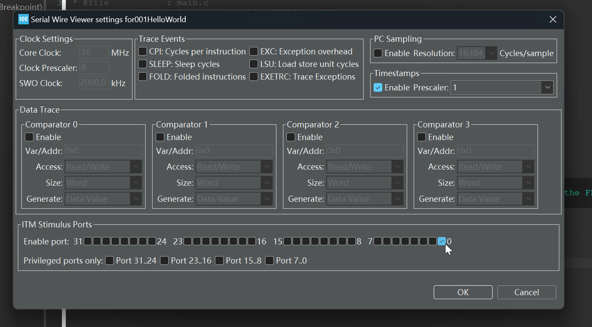

# 15.  Testing Hello-World through SWV


```c
/////////////////////////////////////////////////////////////////////////////////////////////////////////
//					Implementation of printf like feature using ARM Cortex M3/M4/ ITM functionality
//					This function will not work for ARM Cortex M0/M0+
//					If you are using Cortex M0, then you can use semihosting feature of openOCD
/////////////////////////////////////////////////////////////////////////////////////////////////////////


//Debug Exception and Monitor Control Register base address
#define DEMCR        			*((volatile uint32_t*) 0xE000EDFCU )

/* ITM register addresses */
#define ITM_STIMULUS_PORT0   	*((volatile uint32_t*) 0xE0000000 )
#define ITM_TRACE_EN          	*((volatile uint32_t*) 0xE0000E00 )

void ITM_SendChar(uint8_t ch)
{

	//Enable TRCENA
	DEMCR |= ( 1 << 24);

	//enable stimulus port 0
	ITM_TRACE_EN |= ( 1 << 0);

	// read FIFO status in bit [0]:
	while(!(ITM_STIMULUS_PORT0 & 1));

	//Write to ITM stimulus port0
	ITM_STIMULUS_PORT0 = ch;
}
```

Reference: https://github.com/niekiran/Embedded-C/blob/master/All_source_codes/target/itm_send_data.c

1. **Macro Definitions**:
   - `DEMCR`: This macro defines the base address of the Debug Exception and Monitor Control Register. It's a memory-mapped register that controls various debugging features.
   - `ITM_STIMULUS_PORT0`: This macro defines the base address of ITM Stimulus Port 0, which is used to send data to the ITM for tracing purposes.(used at configure trace afterwards)
   - `ITM_TRACE_EN`: This macro defines the base address for enabling ITM trace ports.
2. **`ITM_SendChar` Function**:
   - This function is used to send a single character (`uint8_t ch`) to the ITM for tracing.
   - `DEMCR |= (1 << 24);`: This line sets bit 24 in the `DEMCR` register, which enables the ITM Trace Control and Enable Register (ITM_TCR).
   - `ITM_TRACE_EN |= (1 << 0);`: This line enables Stimulus Port 0 by setting bit 0 in the `ITM_TRACE_EN` register. This allows data to be sent to Stimulus Port 0.
   - `while (!(ITM_STIMULUS_PORT0 & 1));`: This is a polling loop that waits until bit 0 of `ITM_STIMULUS_PORT0` is set, indicating that the ITM is ready to accept data.
   - `ITM_STIMULUS_PORT0 = ch;`: Finally, this line writes the character `ch` to ITM Stimulus Port 0, sending it for tracing.

This is code for ITM_send_data 

Copy and paste it to the `Src/syscalls.c`


put the ITM function into the write function


The `ITM_SendChar()` writes into the ITM FIFO and from FIFO it comes over the SWO line all way back to the ST-LINK circuitry, and from there it comes to our PC's IDE.

## Connect Board

### Go to the `debug configuration` and make sure that the SWV is enabled.

If you don't select this then your IDE will not capture the message coming over `SWO` into IDE.


### Debug it.

### Switch the perspective.

### Open the window option and select `SWV ITM Data Console`


### Open the `Configure Trace` on the right.


### Choose the port0 `#define ITM_STIMULUS_PORT0 *((volatile uint32_t*) 0xE0000000 )`




### Result:

Just be careful, when push the `Start Trace` button, you should use the mouse select the `SWV ITM Data Console` window, make sure this window is selected, because the button has no reflects like deepen color.


